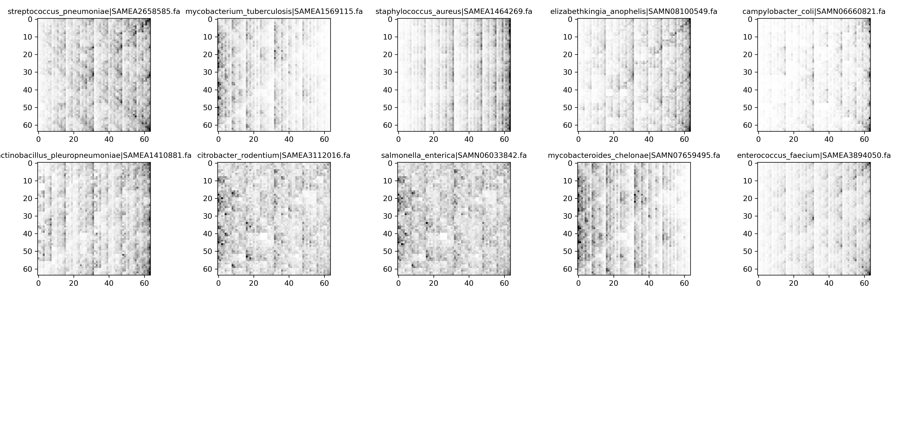
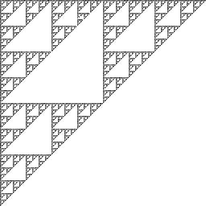
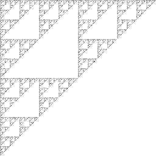
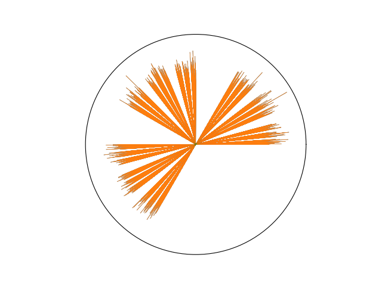

# `complexcgr` 
`complexcgr` contains classes around the *Chaos Game Representation* for DNA sequences.

**The FCGR helps to visualize a k-mer distribution** The `FCGR` of a sequence is an image showing the distribution of the $k$-mers 
given a chosen $k$. The frequencies of all $k$-mers are distributed in the position of a matrix of $2^k \times 2^k$,
which considers all the possible $k$-mers: $4^k$.

The position that a $k$-mer uses in the matrix depends on the encoding given by the `CGR`. 

Some examples of [bacterial assemblies](https://zenodo.org/records/4602622) ([see reference](https://journals.plos.org/plosbiology/article?id=10.1371/journal.pbio.3001421)) are shown below. 
The name of the species and the `sample_id` is in the title of each image ([see an example with the first image](https://www.ebi.ac.uk/ena/browser/view/SAMEA2658585)). These images were 
created using the 6-mers of each assembly and the class `FCGR` of this library. 

|  |
|:--:|
|10 different species of bacteria represented by their FCGR (6-mers)| -->

## Installation
[pypi](https://pypi.org/project/complexcgr/)
___
```shell
pip install complexcgr
```

to update to the latest version
```shell
pip install complexcgr --upgrade
```

> version 0.8.0:  
A list of available classes and functionalities are listed below:

**Encoders**
The encoders are functions that map a sequence $s \in \{A,C,G,T\}$ to a point in the plane. 
`CGR`, `iCGR`, and `ComplexCGR`.

`CGR`  Chaos Game Representation: encodes a DNA sequence in 3 numbers $(N,x,y)$
- [x] encode a sequence.
- [x] recover a sequence from a CGR encoding.

`iCGR` integer CGR: encodes a DNA sequence in 3 integers $(N,x,y)$. 

`CGR`  Chaos Game Representation: encodes a DNA sequence in 3 numbers $(N,x,y)$
- [x] encode a sequence.
- [x] recover a sequence from a CGR encoding.

`iCGR` integer CGR: encodes a DNA sequence in 3 integers $(N,x,y)$. 
- [x] encode a sequence
- [x] recover a sequence from an iCGR encoding

`ComplexCGR`: encodes a DNA sequence in 2 integers $(k,N)$.
- [x] encode a sequence
- [x] recover a sequence from a ComplexCGR encoding
- [x] plot sequence of ComplexCGR encodings 

**Image for distribution of k-mers**

- [x] `FCGR` Frequency Matrix CGR: representation as an image for k-mer representativity, based on CGR.
  - [x] generates FCGR from an arbitrary n-long sequence.
  - [x] plot FCGR.
  - [x] save FCGR generated.
  - [x] save FCGR in different bits.
- [x] `FCGRKmc` Same as `FCGR` but receives as input the file with k-mer counts generated with [KMC](https://github.com/refresh-bio/KMC)
- [x] `ComplexFCGR`: Frequency ComplexCGR: representation as an image (circle) for k-mer representativity, based on ComplexCGR.
  - [x] generates ComplexFCGR from an arbitrary n-long sequence.
  - [x] plot ComplexFCGR.
  - [x] save ComplexFCGR generated.

## How to use
___
### 1. `CGR` Chaos Game Representation of DNA 
```python
from complexcgr import CGR

# Instantiate class CGR
cgr = CGR()

# encode a sequence
cgr.encode("ACGT")
# > CGRCoords(N=4, x=0.1875, y=-0.5625)

# recover a sequence from CGR coordinates
cgr.decode(N=4,x=0.1875,y=-0.5625)
# > "ACGT"
```

### 2. `FCGR` Frequency Matrix of Chaos Game Representation of DNA
Input for FCGR only accept sequences in $\{A,C,G,T,N\}$, but all $k$-mers that contains an $N$ 
will not be considered for the calculation of the frequency matrix CGR
```python
import random; random.seed(42)
from complexcgr import FCGR

# set the k-mer
fcgr = FCGR(k=8) # (256x256) array

# Generate a random sequence without T's
seq = "".join(random.choice("ACG") for _ in range(300_000))
chaos = fcgr(seq) # an array with the frequencies of each k-mer
fcgr.plot(chaos)
```
|  |
|:--:|
|FCGR representation for a sequence without T's|


You can save the image with
```python
fcgr.save_img(chaos, path="img/ACG.jpg")
```
*Formats allowed are defined by PIL.*

You can also generate the image in 16 (or more bits), to avoid losing information of k-mer frequencies
```python
# Generate image in 16-bits (default is 8-bits)
fcgr = FCGR(k=8, bits=16) # (256x256) array. When using plot() it will be rescaled to [0,65535] colors
```


```python
# Generate a random sequence without T's and lots of N's
seq = "".join(random.choice("ACGN") for _ in range(300_000))
chaos = fcgr(seq) # an array with the probabilities of each k-mer
fcgr.plot(chaos)
```


||
|:--:|
|FCGR representation for a sequence without T's and lots of N's|


### 3. `iCGR` integer Chaos Game Representation of DNA 
```python
from complexcgr import iCGR

# Instantiate class CGR
icgr = iCGR()

# encode a sequence
icgr.encode("ACGT")
# > CGRCoords(N=4, x=3, y=-9)

# recover a sequence from CGR coordinates
icgr.decode(N=4,x=3,y=-9)
# > "ACGT"
```

### 4. `ComplexCGR` Complex Chaos Game Representation of DNA (ComplexCGR)

```python
from complexcgr import ComplexCGR

# Instantiate class CGR
ccgr = ComplexCGR()

# encode a sequence
ccgr.encode("ACGT")
# > CGRCoords(k=228,N=4)

# recover a sequence from ComplexCGR coordinates
ccgr.decode(k=228,N=4)
# > "ACGT"

```

### 5. `ComplexFCGR` Frequency Matrix of Complex Chaos Game Representation of DNA
Input for FCGR only accept sequences in $\{A,C,G,T,N\}$, but all $k$-mers that contains an $N$ 
will not be considered for the calculation of the frequency matrix CGR
```python
import random; random.seed(42)
from complexcgr import FCGR

# set the k-mer desired
cfcgr = ComplexFCGR(k=8) # 8-mers

# Generate a random sequence without T's
seq = "".join(random.choice("ACG") for _ in range(300_000))
fig = cfcgr(seq)

```
|  |
|:--:|
|ComplexFCGR representation for a sequence without T's|


You can save the image with
```python
cfcgr.save(fig, path="img/ACG-ComplexCGR.png")
```
*Currently the plot must be saved as png*

___
## Advice for Real applications

**Count k-mers** could be the bottleneck for large sequences (> 100000 bp). 
Note that the class `FCGR` (and `ComplexCGR`) has implemented a naive approach to count k-mers, this is intended since in practice state-of-the-art tools like KMC or Jellyfish are used to count k-mers very efficiently. 

We provide the class `FCGRKmc`, that receives as input the file generated by the following pipeline using [KMC3](https://github.com/refresh-bio/KMC) 

Make sure to have `kmc` installed. One recommended way is to create a conda environment and [install it there](https://anaconda.org/bioconda/kmc)

```bash
kmer_size=6
input="path/to/sequence.fa"
output="path/to/count-kmers.txt"

mkdir -p tmp-kmc
kmc -v -k$kmer_size -m4 -sm -ci0 -cs100000 -b -t4 -fa $input $input "tmp-kmc"
kmc_tools -t4 -v transform $input dump $output 
rm -r $input.kmc_pre $input.kmc_suf
```
the output file `path/to/count-kmers.txt` can be used with `FCGRKmc`

```python
from complexcgr import FCGRKmc

kmer = 6
fcgr = FCGRKmc(kmer)

arr = fcgr("path/to/count-kmers.txt") # k-mer counts ordered in a matrix of 2^k x 2^k


# to visualize the distribution of k-mers. 
# Frequencies are scaled between [min, max] values. 
# White color corresponds to the minimum value of frequency
# Black color corresponds to the maximum value of frequency
fcgr.plot(arr) 

# Save it with numpy
import numpy as np
np.save("path_save/fcgr.npy",arr)
```

___ 
# Videos

**CGR encoding**

[](https://youtu.be/HU15ge0fkOY)


**CGR encoding of all k-mers** This will define the positions of k-mers in the FCGR image.

[](https://youtu.be/oYLT11Q9n5M)


**ComplexCGR encoding**
[](https://www.youtube.com/watch?v=xKyXplS5KFk)

**ComplexCGR and Symmetry**
[](https://www.youtube.com/watch?v=xKyXplS5KFk)

